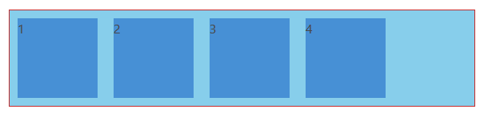
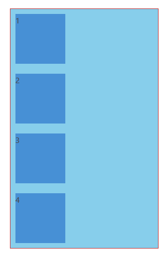
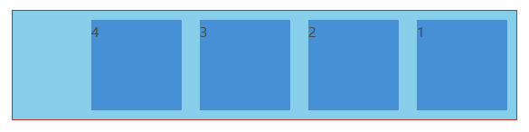
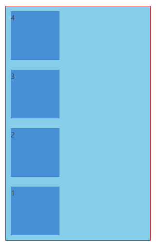
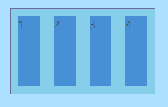
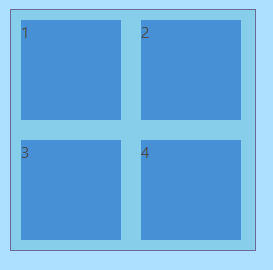
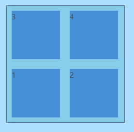

# CSS

**Table of content**
- **CSS layout**
    - **[Flexbox layout](#flexbox)**
    - **[Grid layout](#grid)**
        - **[Important terminology](#important-terminology)**
        - **[Properties for the Parent](#properties-for-the-parent)**
        - **[Properties for the Children](#properties-for-the-children)**
---

## Flexbox

### Flex axis

* main-axis
* cross-axis

*flex-direction: row;*


*flex-direction: column*


```html
    <div class="container">
        <div class="item">1</div>
        <div class="item">2</div>
        <div class="item">3</div>
        <div class="item">4</div>
    </div>
```

```css
    .container {
        display: flex;
        flex-direction: row;
        border: 1px solid rgb(199, 42, 42);
        background-color: skyblue; 
    }

    .item {
        width:100px;
        height:100px;
        background-color:#4790d5;
        margin:10px;
    }
```


### **display: flex;**
### **flex-direction**
* row (default) ```flex-direction: row;```

    

* column ```flex-direction: column;```

    

* row-reverse ```flex-direction: row-reverse;```

    

* column-reverse ```flex-direction: column-reverse;```

    


### **flex-wrap**
* nowrap (default) ```flex-wrap: nowrap;```

    

* wrap ```flex-wrap: wrap;```

    

* wrap-reverse ```flex-wrap: wrap-reverse;```

    

### **flex-flow** - is a combined property for both ```flex-direction``` and ```flex-wrap```

```css
    flex-flow: column wrap;
    /* is equal to writing */
    flex-direction: column;
    flex-wrap: wrap;
```


### **justify-content** work on main axis

```css
    justify-content: flex-start || flex-end || center || space-around || space-between;
    /* default: flex-start */
```


### **align-items** work on cross axis

```css
    align-items: stretch || flex-start || flex-end || center || baseline;
```


### **align-content**

```css
    align-content: flex-start || flex-end || center || space-between || space-around || stretch;
```

### **align-self**

```css
    align-self: flex-start || flex-end || center || baseline || stretch;
```

### **order**

```css
    order: -1 || 0 || 1 || 2; 
    /* default is 0 */
```


### **flex-grow**

```css
    flex-grow: 0 || 1;
    /* default is 0 */
```


---
## Grid
### Important terminology
- **Grid Container**
- **Grid Item**
- **Grid Line**
- **Grid Track**
- **Grid Cell**
- **Grid Area**

#### Grid Container
The element on which display: grid is applied. It's the direct parent of all the grid items. In this example container is the grid container.
#### Grid Item
The children of the grid container. Here the item elements are grid items, but sub-item isn't.
#### Grid Line
The dividing lines that make up the structure of the grid. They can be either vertical ("column grid lines") or horizontal ("row grid lines") and reside on either side of a row or column. Here the yellow line is an example of a column grid line.


#### Grid Track
The space between two adjacent grid lines. You can think of them like the columns or rows of the grid. Here's the grid track between the second and third row grid lines.


#### Grid Cell
The space between two adjacent row and two adjacent column grid lines. It's a single "unit" of the grid. Here's the grid cell between row grid lines 1 and 2, and column grid lines 2 and 3.


#### Grid Area
The total space surrounded by four grid lines. A grid area may be comprised of any number of grid cells. Here's the grid area between row grid lines 1 and 3, and column grid lines 1 and 3.


---

### Properties for the Parent
1. **display**
1. **grid-template-columns**
1. **grid-template-rows**
1. **grid-template-areas**
1. **grid-template-areas**
1. **grid-column-gap**
1. **grid-row-gap**
1. **grid-gap**
1. **justify-items**
1. **align-items**
1. **justify-content**
1. **align-content**
1. **grid-auto-columns**
1. **grid-auto-rows**
1. **grid-auto-flow**
1. **grid**
---

1. **display**
    - Values
        - grid: generates a block-level grid
        - inline-grid: generates an inline-level grid
        - subgrid: if your grid container is itself a grid item, you can use this property to indicate that you want the sizes of its rows/columns to be taken from its parent rather than specifying its own
    - Example

    ```css
        .container {
            display: grid | inline-grid | subgrid;
        }
    ```

1. **grid-template-columns**
1. **grid-template-rows**

    - Values
        - [line-name] - an arbitrary name of your choosing
        - [track-size] - can be a length, a percentage, or a fraction of the free space in the grid 
    - Example

    ```css
        .container {
            grid-template-columns: 40px 50px auto 50px 40px;
            grid-template-rows: 25% 100px auto;
        }
    ```

    

    or

    ```css
        .container {
            grid-template-columns: [first] 40px [line2] 50px [line3] auto [col4-start] 50px [five] 40px [end];
            grid-template-rows: [row1-start] 25% [row1-end] 100px [third-line] auto [last-line];
        }
    ```

    


1. **grid-template-areas**

    - Values
        - [grid-area-name] - the name of a grid area specified with grid-area
        - . - a period signifies an empty grid cell
        - none - no grid areas are defined
    - Example

    ```css
        .item-a {
            grid-area: header;
        }
        .item-b {
            grid-area: main;
        }
        .item-c {
            grid-area: sidebar;
        }
        .item-d {
         grid-area: footer;
        }

        .container {
            grid-template-columns: 50px 50px 50px 50px;
            grid-template-rows: auto;
            grid-template-areas: 
                "header header header header"
                "main main . sidebar"
                "footer footer footer footer";
        }
    ```

        

1. **grid-template**

    > A shorthand for setting grid-template-rows, grid-template-columns, and grid-template-areas in a single declaration.

    - Values
        - none - sets all three properties to their initial values
        - subgrid - sets grid-template-rows and grid-template-columns to subgrid, and grid-template-areas to its initial value
        - [grid-template-rows] / [grid-template-columns] - sets grid-template-columns and grid-template-rows to the specified values, respectively, and sets grid-template-areas to none
    - Example

    ```css
        .container {
            grid-template:
                [row1-start] "header header header" 25px [row1-end]
                [row2-start] "footer footer footer" 25px [row2-end]
                / auto 50px auto;
        }
    ```

    That's equivalent to this:

    ```css
        .container {
            grid-template-rows: [row1-start] 25px [row1-end row2-start] 25px [row2-end];
            grid-template-columns: auto 50px auto;
            grid-template-areas: 
                "header header header" 
                "footer footer footer";
        }
    ```

    > use the grid property instead of grid-template

1. **grid-column-gap**
1. **grid-row-gap**

    - Values
        - [line-size] - a length value
    - Example

    ```css 
        .container {
            grid-template-columns: 100px 50px 100px;
            grid-template-rows: 80px auto 80px; 
            grid-column-gap: 10px;
            grid-row-gap: 15px;
        }
    ```

    

1. **grid-gap**

    > A shorthand for grid-row-gap and grid-column-gap

    - Values
        - [grid-row-gap] [grid-column-gap] - length values
    - Example

    ```css
        .container {
            grid-template-columns: 100px 50px 100px;
            grid-template-rows: 80px auto 80px; 
            grid-gap: 10px 15px;
        }
    ```

1. **justify-items**

    - Values
        - start - aligns the content to the left end of the grid area
        - end - aligns the content to the right end of the grid area
        - center - aligns the content in the center of the grid area
        - stretch - fills the whole width of the grid area (this is the default)
    - Example

    ```css
        .container {
            justify-items: start;
        }
    ```

    

    ```css
        .container{
            justify-items: end;
        }
    ```

    

    ```css
        .container {
            justify-items: center;
        }
    ```

    

    ```css
        .container {
            justify-items: stretch;
        }
    ```

    


1. **align-items**

    - Values
        - start - aligns the content to the top of the grid area
        - end - aligns the content to the bottom of the grid area
        - center - aligns the content in the center of the grid area
        - stretch - fills the whole height of the grid area (this is the default)
    - Example

    ```css
        .container {
            align-items: start;
        }
    ```

    

    ```css
        .container {
            align-items: end;
        }
    ```

    

    ```css
        .container {
            align-items: center;
        }
    ```

    

    ```css
        .container {
            align-items: stretch;
        }
    ```

    

1. **justify-content**

    - Values
        - start - aligns the grid to the left end of the grid container
        - end - aligns the grid to the right end of the grid container
        - center - aligns the grid in the center of the grid container
        - stretch - resizes the grid items to allow the grid to fill the full width of the grid container
        - space-around - places an even amount of space between each grid item, with half-sized spaces on the far ends
        - space-between - places an even amount of space between each grid item, with no space at the far ends
        - space-evenly - places an even amount of space between each grid item, including the far ends
    - Example

    ```css
        .container {
            justify-content: start;
        }
    ```

    

    ```css
        .container {
            justify-content: end;	
        }
    ```

    

    ```css
        .container {
            justify-content: center;	
        }
    ```

    

    ```css
        .container {
            justify-content: stretch;	
        }
    ```

    

    ```css
        .container {
            justify-content: space-around;	
        }
    ```

    

    ```css
        .container {
            justify-content: space-between;	
        }
    ```

    

    ```css
        .container {
            justify-content: space-evenly;	
        }
    ```

    

1. **align-content**

    - Values
        - start - aligns the grid to the top of the grid container
        - end - aligns the grid to the bottom of the grid container
        - center - aligns the grid in the center of the grid container
        - stretch - resizes the grid items to allow the grid to fill the full height of the grid container
        - space-around - places an even amount of space between each grid item, with half-sized spaces on the far ends
        - space-between - places an even amount of space between each grid item, with no space at the far ends
        - space-evenly - places an even amount of space between each grid item, including the far ends
    - Example

    ```css
        .container {
            align-content: start;	
        }
    ```

    

    ```css
        .container {
            align-content: end;	
        }
    ```

    

    ```css
        .container {
            align-content: center;	
        }
    ```

    

    ```css
        .container {
            align-content: stretch;	
        }
    ```

    

    ```css
        .container {
            align-content: space-around;	
        }
    ```

    

    ```css
        .container {
            align-content: space-between;	
        }
    ```

    

    ```css
        .container {
            align-content: space-evenly;	
        }
    ```

    


1. **grid-auto-columns**
1. **grid-auto-rows**

    - Values
        - [track-size] - can be a length, a percentage, or a fraction of the free space in the grid 
    - Example

    ```css
        .container {
            grid-template-columns: 60px 60px;
            grid-template-rows: 90px 90px;
            grid-auto-columns: 60px;
        }
        .item-a {
            grid-column: 1 / 2;
            grid-row: 2 / 3;
        }
        .item-b {
            grid-column: 5 / 6;
            grid-row: 2 / 3;
        }
    ```

    

1. **grid-auto-flow**

    - Values
        - row - tells the auto-placement algorithm to fill in each row in turn, adding new rows as necessary
        - column - tells the auto-placement algorithm to fill in each column in turn, adding new columns as necessary
        - dense - tells the auto-placement algorithm to attempt to fill in holes earlier in the grid if smaller items come up later
    - Example

    ```html
        <section class="container">
            <div class="item-a">item-a</div>
            <div class="item-b">item-b</div>
            <div class="item-c">item-c</div>
            <div class="item-d">item-d</div>
            <div class="item-e">item-e</div>
        </section>
    ```

    ```css
        .container {
            display: grid;
            grid-template-columns: 60px 60px 60px 60px 60px;
            grid-template-rows: 30px 30px;
            grid-auto-flow: row;
        }
        .item-a {
            grid-column: 1;
            grid-row: 1 / 3;
        }
        .item-e {
            grid-column: 5;
            grid-row: 1 / 3;
        }
    ```

    

    ```css
        .container {
            display: grid;
            grid-template-columns: 60px 60px 60px 60px 60px;
            grid-template-rows: 30px 30px;
            grid-auto-flow: column;
        }
    ```

    

1. **grid**

    > A shorthand for setting all of the following properties in a single declaration: grid-template-rows, grid-template-columns, grid-template-areas, grid-auto-rows, grid-auto-columns, and grid-auto-flow. It also sets grid-column-gap and grid-row-gap to their initial values, even though they can't be explicitly set by this property.

    - Values
        - none - sets all sub-properties to their initial values
        - [grid-template-rows] / [grid-template-columns] - sets grid-template-rows and grid-template-columns to the specified values, respectively, and all other sub-properties to their initial values
        - [grid-auto-flow] [[grid-auto-rows] [ / [grid-auto-columns] ] - accepts all the same values as grid-auto-flow, grid-auto-rows and grid-auto-columns, respectively. If grid-auto-columns is omitted, it is set to the value specified for grid-auto-rows. If both are omitted, they are set to their initial values
    - Example

    ```css
        .container {
            grid: 200px auto / 1fr auto 1fr;
        }
    ```

    That's equivalent to this:

    ```css 
        .container {
            grid-template-rows: 200px auto;
            grid-template-columns: 1fr auto 1fr;
            grid-template-areas: none;
        }
    ```

    And the following two code blocks are equivalent:

    ```css
        .container {
            grid: column 1fr / auto;
        }
    ```

    ```css
        .container {
            grid-auto-flow: column;
            grid-auto-rows: 1fr;
            grid-auto-columns: auto;
        }
    ```

---

### Properties for the Children

1. grid-column-start
1. grid-column-end
1. grid-row-start
1. grid-row-end
1. grid-column
1. grid-row
1. grid-area
1. justify-self
1. align-self

---

1. grid-column-start
1. grid-column-end
1. grid-row-start
1. grid-row-end

    - Values
        - [line] - can be a number to refer to a numbered grid line, or a name to refer to a named grid line
        - [span number] - the item will span across the provided number of grid tracks
        - [span name] - the item will span across until it hits the next line with the provided name
        - auto - indicates auto-placement, an automatic span, or a default span of one
    - Example 

    ```css
        .item-a {
            grid-column-start: 2;
            grid-column-end: five;
            grid-row-start: row1-start;
            grid-row-end: 3
        }
    ```

    

    ```css
        .item-b {
            grid-column-start: 1;
            grid-column-end: span col4-start;
            grid-row-start: 2
            grid-row-end: span 2
        }
    ```

    

1. grid-column
1. grid-row

    > Shorthand for grid-column-start + grid-column-end, and grid-row-start + grid-row-end, respectively.

    - Values
        - [start-line] / [end-line] - each one accepts all the same values as the longhand version, including span
    - Example

    ```css
        .item-c {
            grid-column: 3 / span 2;
            grid-row: third-line / 4;
        }
    ```

    

1. grid-area

    - Values
        - [name] - a name of your choosing
        - [row-start] / [column-start] / [row-end] / [column-end] - can be numbers or named lines
    - Example 

    As a way to assign a name to the item:

    ```css
        .item-d {
            grid-area: header
        }
    ```

    As the short-shorthand for grid-row-start + grid-column-start + grid-row-end + grid-column-end:

    ```css 
        .item-d {
            grid-area: 1 / col4-start / last-line / 6
        }
    ```

    

1. justify-self

    - Values
     - start - aligns the content to the left end of the grid area
     - end - aligns the content to the right end of the grid area
     - center - aligns the content in the center of the grid area
     - stretch - fills the whole width of the grid area (this is the default)
    - Example

    ```css
        .item-a {
            justify-self: start;
        }
    ```

    

    ```css
        .item-a {
            justify-self: end;
        }
    ```

    

    ```css
        .item-a {
            justify-self: center;
        }
    ```

    

    ```css
        .item-a {
            justify-self: stretch;
        }
    ```

        
1. align-self

    - Values
        -  start - aligns the content to the top of the grid area
        - end - aligns the content to the bottom of the grid area
        - center - aligns the content in the center of the grid area
        - stretch - fills the whole height of the grid area (this is the default)
    - Example

    ```css
        .item-a {
            align-self: start;
        }
    ```

    

    ```css
        .item-a {
            align-self: end;
        }
    ```

    

    ```css
        .item-a {
            align-self: center;
        }
    ```

    

    ```css
        .item-a {
            align-self: stretch;
        }
    ```

    
