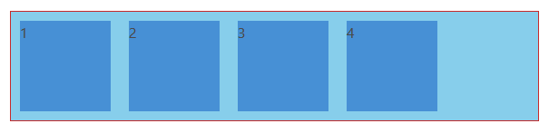
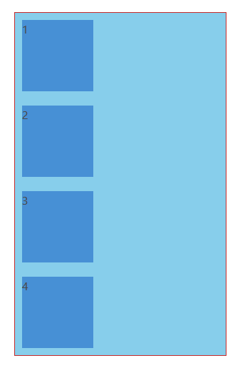
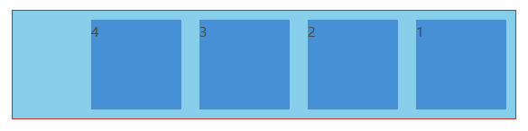
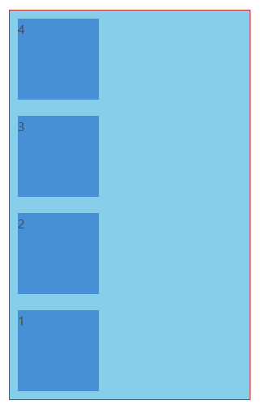
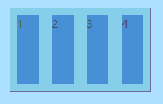
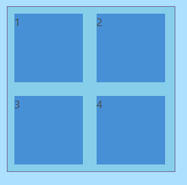
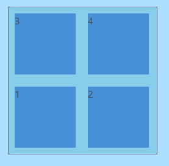

# CSS
## Flexbox
```html
    <div class="container">
        <div class="item">1</div>
        <div class="item">2</div>
        <div class="item">3</div>
        <div class="item">4</div>
    </div>
```

```css
    .container {
        display: flex;
        flex-direction: row;
        border: 1px solid rgb(199, 42, 42);
        background-color: skyblue; 
    }

    .item {
        width:100px;
        height:100px;
        background-color:#4790d5;
        margin:10px;
    }
```


* **display: flex;**
* **flex-direction**
    * row (default)
    ```css
        flex-direction: row;
    ```
    
    * column
    ```css
        flex-direction: column;
    ```
    
    * row-reverse
    ```css
        flex-direction: row-reverse;
    ```
    
    * column-reverse
    ```css
        flex-direction: column-reverse;
    ```
    


* **flex-wrap**
    * nowrap (default)

    
    * wrap

    
    * wrap-reverse

    

* **flex-flow** - is a combined property for both ```flex-direction``` and ```flex-wrap```

```css
    flex-flow: column wrap;
    /* is equal to writing */
    flex-direction: column;
    flex-wrap: wrap;
```

* ***flex-axis***
    * main-axis
    * cross-axis

    *flex-direction: row;*
    

    *flex-direction: column*
    


* **justify-content** work on main axis

```css
    justify-content: flex-start || flex-end || center || space-around || space-between;
```


* **align-items** work on cross axis

```css
    align-items: stretch || flex-start || flex-end || center || baseline;
```


* **order**

```css
    order: -1 || 0 || 1 || 2; 
    /* default is 0 */
```


* **flex-grow**

```css
    flex-grow: 0 || 1;
    /* default is 0 */
```


